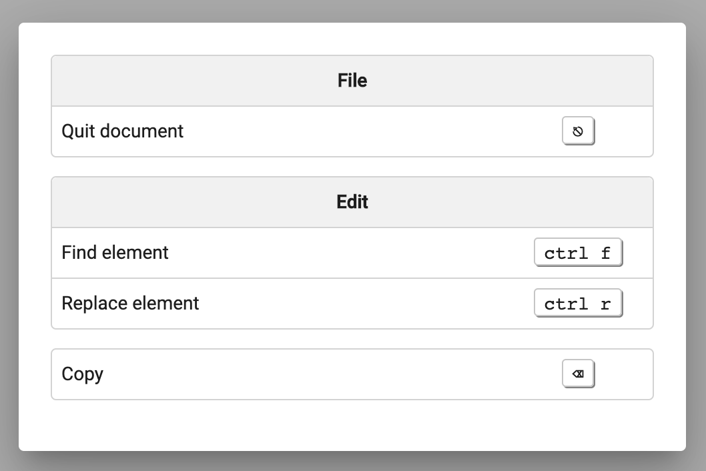

<p align="center">
 
</p>

<br />

[]()
[]()
[]()
[](https://github.com/prettier/prettier)
[](#contributors-)
[](https://github.com/ngneat/)
[]()

> Power up your app with Hotkeys!

Web apps are getting closer and closer to be desktop-class applications. With this in mind, it makes sense to add hotkeys for those power users that are looking to navigate their favorite websites using hotkeys just as they do on their regular native apps. To help you have a better experience including hotkeys in your project, we develop Hotkeys.

## Features

- ✅ Definition on code-behind
- ✅ Definition on view
- ✅ Key combinations
- ✅ Element scoped
- ✅ Global listeners
- ✅ Platform agnostic
- ✅ Hotkeys cheatsheet

## Table of Contents

- [Installation](#installation)
- [Usage](#usage)
- [FAQ](#faq)

## Installation

### NPM

`npm install @ngneat/hotkeys --save-dev`

### Yarn

`yarn add @ngneat/hotkeys --dev`

## Usage

The first step is to add `HotkeysModule` in your `AppModule`. 

Once you've done this, there are two ways to start adding shortcuts to your application.

1. Using a directive directly on your target view.
2. Using a global service code-behind.

## Hotkeys Directive
Using the directive only requires importing `HotkeysModule` and adding `[hotkeys]` to a template element and pass in a shortcut. As you can see in the example down below, shortcuts are formatted as a string listing the keys separated by a period character.

```html
<div [hotkeys]="'meta.a'" (hotkey)="handleHotkey($event)" tabindex="1">
  NgNeat Hotkeys!
</div
```

> Note: Hotkeys takes care of transforming keys from macOS to Linux and Windows and vice-versa.

The directive exposes an output event `(hotkey)` that relays the keyboard event to the underlaying controller.

Additionally, the directive accepts three more input parameters.

* `hotkeysGroup` - define a group name.
* `hotkeysDescription` - add a description.
* `hotkeysOptions` - set more specific options.

`hotkeysOptions` accepts a subset of the following object.

```ts
interface Options {
  trigger: 'keydown' | 'keyup'; // listen to keydown or keyup events. It's keydown by default.
  showInHelpMenu: boolean; // include the hotkey to be display in the help menu. It's true by default.
  preventDefault: boolean; // whether to prevent default behavior in the target element. It's true by default.
}
```
For example,

```ts
  <div
  [hotkeys]="'meta.a'"
  (hotkey)="handleHotkey($event)"
  [hotkeysGroup]="'File'"
  [hotkeysDescription]="'Create new document'"
  [hotkeysOptions]="{preventDefault: false, trigger: 'keyup', showInHelpMenu: false}">
    NgNeat Hotkeys!
  </div>

```

## Hotkeys Service
This is a global service that can be injected into any component.
```ts
import { Component} from '@angular/core';
import { HotkeysService } from '@ngneat/hotkeys';

@Component({
  selector: 'app-root',
  templateUrl: './app.component.html',
  styleUrls: ['./app.component.css']
})
export class AppComponent {

  constructor(private hotkeys: HotkeysService) {
  }
}
```

`HotkeyService` exposes the next functionality.

* `addShortcut` - add a new shortcut
```ts
this.hotkeys
  .addShortcut({
    keys: 'backspace'
}).subscribe(e => console.log('Hotkey', e));
```
There are additional properties to customize the definition.

```ts
interface Options {
  group: string; // group name
  element: HTMLElement; // hotkey target element. By default is document.
  trigger: 'keydown' | 'keyup'; // type of event. It's keydown by default.
  description: string; // hotkey description
  showInHelpMenu: boolean; // included in the shortcut list to be display in the help dialog.
  preventDefault: boolean; // whether to prevent the default behavior of the event. It's true by default.
}
```
* `onShortcut` - listen to any register hotkey
This method takes a callback function with three inputs and returns void. Internally we are subscribing to a list of callbacks, so we need to unsubscribe once we're done.
```ts
const unsubscribe = this.hotkeys.onShortcut(
  (event, key, target) => console.log('callback', key)
  );
// when you're done listening, unsubscribe
// unsubscribe(); 
```

* `registerHelpModal` - display a help dialog listing all visible hotkeys

```html
<!-- app.component.html  -->
<div #container style="width: 100%; height: 100vh;" tabindex="0">
  <div
  [hotkeys]="'meta.a'"
  (hotkey)="handleHotkey($event)"
  [hotkeysGroup]="'File'"
  [hotkeysDescription]="'Create new document'"
  [hotkeysOptions]="{preventDefault: false, trigger: 'keyup', showInHelpMenu: false}">
    NgNeat Hotkeys!
  </div>
</div>

```

```ts
// app.component.ts
import { AfterViewInit, Component, ViewChild } from '@angular/core';
import { MatDialog } from '@angular/material/dialog';
import { HotkeysHelpComponent, HotkeysService } from '@ngneat/hotkeys';

@Component({
  selector: 'app-root',
  templateUrl: './app.component.html',
  styleUrls: ['./app.component.css']
})
export class AppComponent implements AfterViewInit {
  @ViewChild('container') container;

  constructor(private hotkeys: HotkeysService, private dialog: MatDialog) {
    /*     fromEvent(document, 'keydown').subscribe(e => console.log(e)); */
  }

  ngAfterViewInit(): void {
    // subscribe help modal
    const helpFcn: () => void = () => {
      this.dialog.open(HotkeysHelpComponent, { width: '500px' });
    };
    this.hotkeys.registerHelpModal(helpFcn);

    // add hotkeys
    this.hotkeys
      .addShortcut({
        keys: 'escape',
        trigger: 'keydown',
        element: this.container.nativeElement,
        description: 'Quit document',
        group: 'File'
      })
      .subscribe(e => console.log('Quit hotkey', e));

    this.hotkeys
      .addShortcut({
        keys: 'ctrl.f',
        element: this.container.nativeElement,
        description: 'Find element',
        group: 'Edit'
      })
      .subscribe(e => console.log('Find hotkey', e));

    this.hotkeys
      .addShortcut({
        keys: 'ctrl.r',
        element: this.container.nativeElement,
        description: 'Replace element',
        group: 'Edit'
      })
      .subscribe(e => console.log('Replace hotkey', e));

    this.hotkeys
      .addShortcut({
        keys: 'backspace',
        trigger: 'keyup',
        description: 'Copy'
      })
      .subscribe(e => console.log('Copy hotkey', e));
  }

  handleHotkey(e: KeyboardEvent) {
    console.log('New document hotkey', e);
  }
}
```
It accepts a second input that allows to define the "show help" hotkey. The default shortcut is Shift + ?.




* `getHotkeys` - retrieve all defined hotkeys application-wide.

It returns a list of `Hotkey` elements with all the defined hotkeys.
```ts
interface Hotkey {
  key: string; // shortcut key
  group: string; // group name
  element: HTMLElement; // target element
  trigger: 'keydown' | 'keyup'; // type of event
  description: string; // shortcut description
  showInHelpMenu: boolean; // hotkey shows in help menu
  preventDefault: boolean; // prevent default event behavior or not
}

```
* `getShortcuts` - retrieve the shortcuts to be displayed in a help screen.

It returns a conveniently formatted list to show in the help dialog.

```ts
{ 
  group: string; // group name
  hotkeys: { keys: string; description: string}[] // hotkey list for this group
}
```

## Hotkeys Shortcut Pipe
There is also available a @Pipe, `hotkeysShortcut`, to help you format your shortcuts when presenting them in a custom help screen.

```html
<div class="help-dialog-shortcut-key">
  <kbd [innerHTML]="hotkey.keys | hotkeysShortcut"></kbd>
</div>
```
The pipe accepts and additional parameter the way key combinations are separated. By default, the separator is " + ". In the next example, a "-" is used as separator.

```html
<div class="help-dialog-shortcut-key">
  <kbd [innerHTML]="hotkey.keys | hotkeysShortcut : '-'"></kbd>
</div>
```


## Hotkeys Help Component
There is also available a @Component, `HotkeysHelpComponent`, which offers a help view of the collection of visible shortcuts. It can be easily used with Angular Material Dialog.

```ts
this.dialog.open(HotkeysHelpComponent, { width: '500px' });
```

That's all for now! Make sure to check out the playground inside the src folder!

## FAQ

**Can I define duplicated hotkeys?**

No. It's not possible to define a hotkey multiple times. Each hotkey has a description and a group, so it doesn't make sense assigning a hotkey to different actions.

**Why am I not receiving any event?**

If you've added a hotkey to a particular element of your DOM, make sure it's focusable. Otherwise, hotkeys cannot capture any keyboard event.


## How to ...

**Listening to the same shortcut in different places.**

You can always use `onShortcut`. This method allows listening to all registered hotkeys without affecting the original definition.

## Contributors ✨

Thanks goes to these wonderful people ([emoji key](https://allcontributors.org/docs/en/emoji-key)):

<!-- ALL-CONTRIBUTORS-LIST:START - Do not remove or modify this section -->
<!-- prettier-ignore-start -->
<!-- markdownlint-disable -->
<!-- markdownlint-enable -->
<!-- prettier-ignore-end -->

<!-- ALL-CONTRIBUTORS-LIST:END -->

This project follows the [all-contributors](https://github.com/all-contributors/all-contributors) specification. Contributions of any kind welcome!
